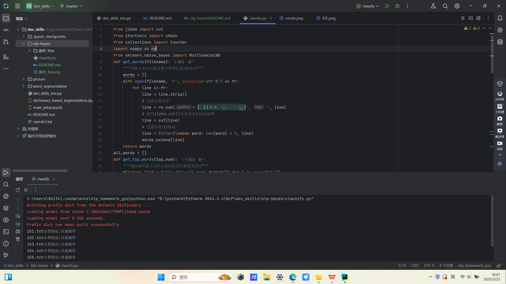
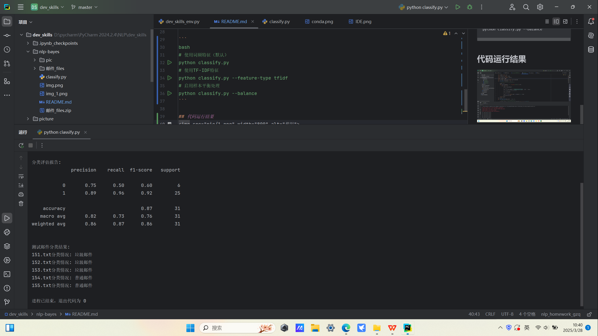
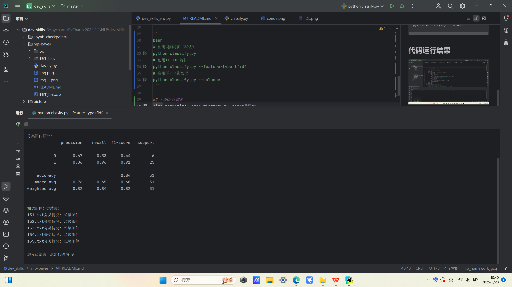
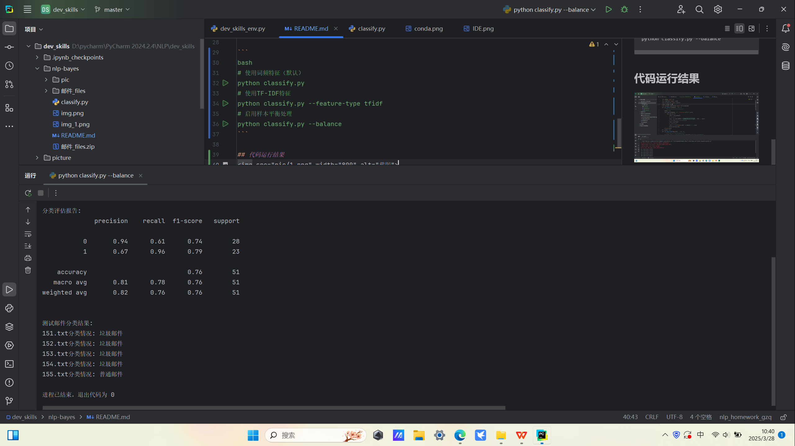

# 基于朴素贝叶斯的邮件分类系统

## 核心功能
- ✅ 支持词频统计（高频词）与TF-IDF两种特征模式切换
- ✅ 提供SMOTE过采样样本平衡处理
- ✅ 输出包含精度/召回率/F1值的分类评估报告
- ✅ 对未知邮件进行自动分类预测

## 算法基础
采用**多项式朴素贝叶斯分类器**，基于以下贝叶斯定理实现：

\[
P(C|X) = {P(X|C)P(C)}{P(X)}
\]

- **特征独立性假设**：假设各单词在给定类别下条件独立
- **多项式分布**：适用于离散型特征（如词频计数）
- **拉普拉斯平滑**：避免零概率问题

## 数据处理流程
1. **文本清洗**：过滤标点符号和数字 `[.【】0-9、——。，！~\*]`
2. **中文分词**：使用jieba分词工具切分文本
3. **停用词过滤**：移除单字词（长度≤1的词汇）
4. **特征标准化**：转换为小写并统一编码格式

# 代码运行结果
## 特征模式切换——命令行参数控制
### classify.py运行结果


### 使用高词频特征运行结果
````
python classify.py
````


### 使用TF-IDF特征
````
python classify.py --feature-type tfidf
````


### 样本平衡处理（选做）运行结果
````
python classify.py --balance
````



